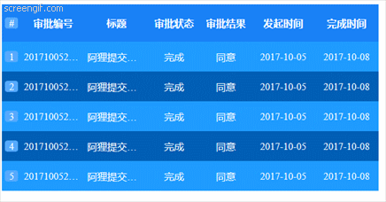

# Scroll Table 滚动表、轮播表

* 插件基于JQuery ,使用前请先引用JQuery
* 代码基于 ES6 语法，兼容 IE 请使用babel转格式
* 插件支持 Ajax 动态传输数据，同时也支持 Object 类型的数据
* 如果你使用了 websoket 协议，持续动态传输数据，可能会引起个隔行变色出现问题
* 如果你使用了 MVVM 框架，尤其时Angular，Vue 可能会造成定时器、隔行变色，数据传输的BUG

*注：本插件建议只用来展示静态数据*

### DOM容器

*你应该先在DOM中创建一个容器*

*这个容器可以自定义大小，但如果你的字段过多，请不要太过于吝啬宽度*

*JQ动态创建元素：*

```javascript
$('body').append('<div id="app" style="width:45%;height:300px;"></div>');
```

*也可以直接写在HTML中：*

```html
<div id="app" style="width:45%;height:300px;"></div>
```

### 参数解析

*你应当只传入一个Object类型的参数，且指定相应的参数*

*除了 el, header,data 参数外，其他都不是必须的，但会影响效果样式！*

```javascript
 @param { Object }  resource 
 @param { String }  el : 指定元素
 @param { Array }   header : 表头
 @param { Array }   data : 数据行
 @param { Number }  rowNum : 显示行数
 @param { Boolean } index : 是否显示索引列
 @param { Number }  timeout : 滚动动画延时
 @param { String }  headerBGC : 标题栏背景颜色
 @param { String }  oddRowBGC : 奇数行背景颜色
 @param { String }  evenRowBGC : 偶数行背景颜色
 @param { String }  fontColor : 字体颜色
 @param { String }  indexBGC : 索引列背景颜色
 @param { Array }   colWidth : 每列的宽度
```

### 静态数据格式

*如果你的数据是静态的，那么header，data,只是两个数组*

````javascript
var header: ["审批编号", "标题", "审批状态", "审批结果", "发起时间", "完成时间"];
//data 是一个二维数组
var data: [
        [201710052242000460750, "阿狸提交的加班申请", "完成", "同意", "2017-10-05", "2017-10-08"],
        [201710052241000060974, "阿狸提交的加班申请", "完成", "同意", "2017-10-05", "2017-10-08"],
        [201710052239000324148, "阿狸提交的加班申请", "完成", "同意", "2017-10-05", "2017-10-08"],
        [201710052237000311339, "阿狸提交的加班申请", "完成", "同意", "2017-10-05", "2017-10-08"],
        [201710052235000398479, "阿狸提交的加班申请", "完成", "同意", "2017-10-05", "2017-10-08"],
        [201710052234000189386, "阿狸提交的加班申请", "完成", "同意", "2017-10-05", "2017-10-08"],
        [201710051803000424810, "佩奇提交的加班申请", "完成", "同意", "2017-10-05", "2017-10-05"],
        [201710031813000246649, "张小凡提交的加班申请", "完成", "同意", "2017-10-03", "2017-10-03"],
        [201710021824000493500, "秀儿提交的加班申请", "完成", "同意", "2017-10-02", "2017-10-02"]
    ];
````

### AJAX调用实例

```javascript
$.ajax({
    url: 'data.json',
    type: 'GET',
    dataType: 'JSON',
    success: function(datas) {
        dynamicTable({
            el: '#app',
            rowNum: 5,
            timeout: 3,
            header: datas.header,
            data: datas.data,
            index: true,
            fontColor: 'white ',
            indexBGC: '#5af',
            headerBGC: '#1981f6',
            oddRowBGC: 'rgba(0, 94, 181)',
            evenRowBGC: 'rgba(30, 155, 255)',
            colWidth: ['25', '100', '100', '80', '80px', '100px', '100px']
        });
    },
    error: function(e) {
        console.log(e)
    }
})
```
### 实例效果

