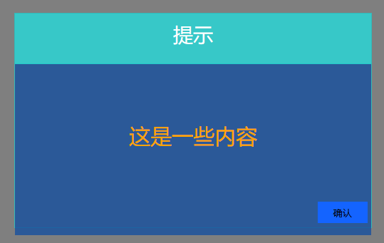

# POP-UP 自定义弹框

* 这是一个自定义的弹框插件
* 主要目的时代替 alert() 使用
* 该插件基于JQuery，但同时也支持再无JQ环境下使用(如果你只用Chrome的情况下！)
* 该插件使用 ES6 语法，兼容 IE11 请手动使用babel转代码！
* 该插件目前不支持多行内容，如果你的字太多的话，手动调整一下代码吧！！！

### 参数解析：

*你应该传一个Object类型的参数，而不是直接传三个参数！*

```javascript
参数一 : title --弹框标题;
参数二 : article --弹框内容;
参数三 : color --字体颜色;
```

### 实例调用:

*你可能疑惑插件的名字，但这不重要，你不喜欢随便改一个就是了！*

```javascript
pcyAlert({
    title:"提示",
    article:"这是一些内容",
    color:"orange"
})
```

### 实例效果：

